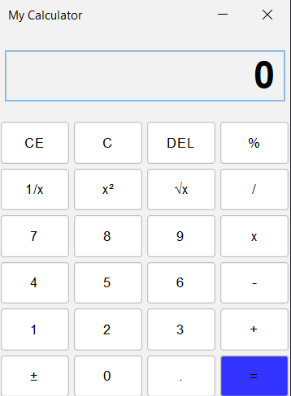

# Calculator GUI Application

This is a simple calculator application built with Java Swing. It provides basic arithmetic operations and some scientific functions, featuring a graphical user interface.

## Features

- Addition, subtraction, multiplication, division
- Percentage calculation
- Reciprocal, square, and square root functions
- Clear (C), Clear Entry (CE), and Delete (DEL) buttons
- Plus/Minus toggle
- Decimal point support

## Requirements

- Java 8 or higher
- [FlatLaf](https://www.formdev.com/flatlaf/) library for modern UI (already imported in the project)
- NetBeans IDE (recommended for building and running)

## How to Run

1. Clone or download this repository.
2. Open the project in NetBeans or your preferred Java IDE.
3. Build the project to resolve dependencies.
4. Run the `Main` class located at  
   `src/lk/jiat/day3/gui/Main.java`.

## Screenshots

## License

This project is for educational purposes.